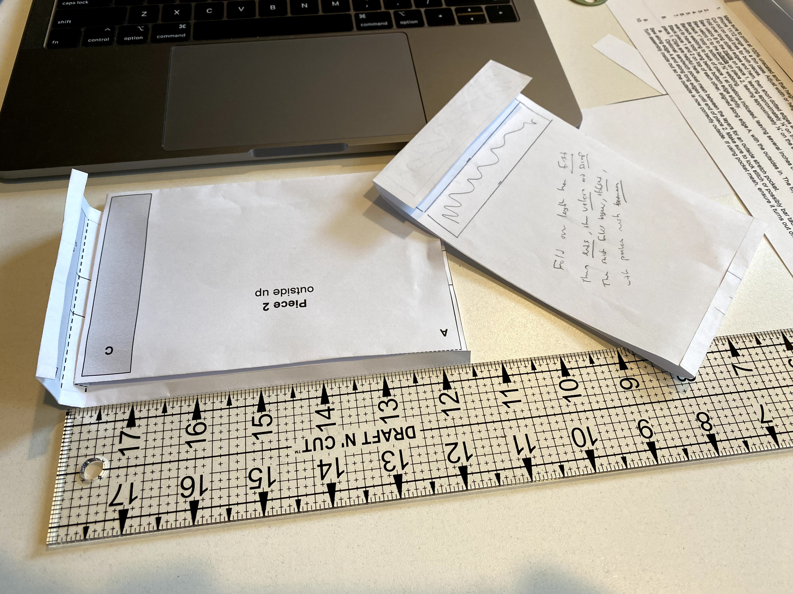
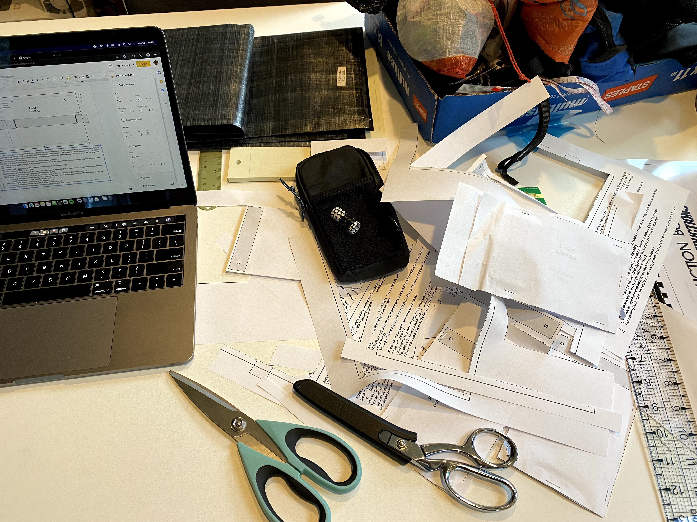
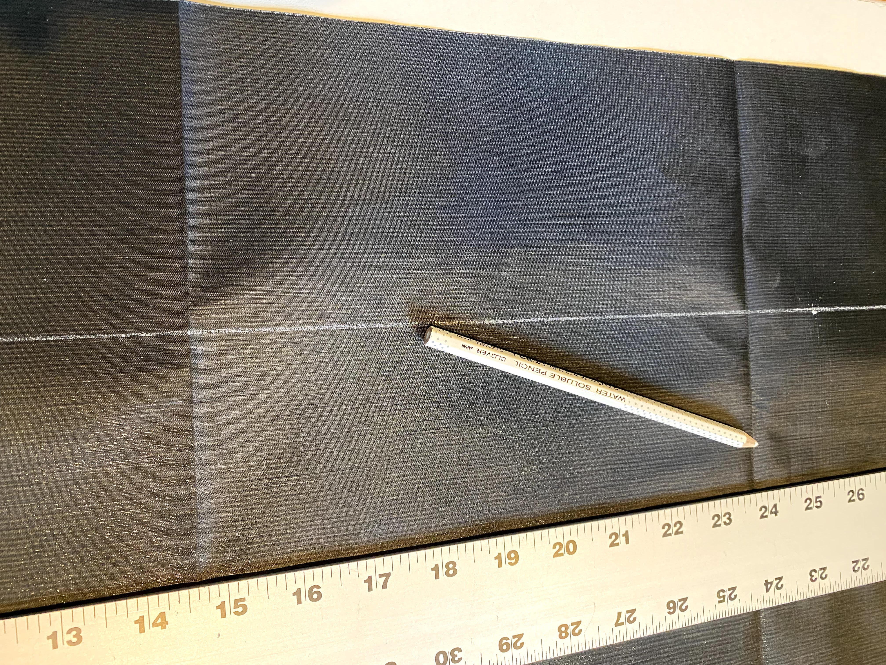
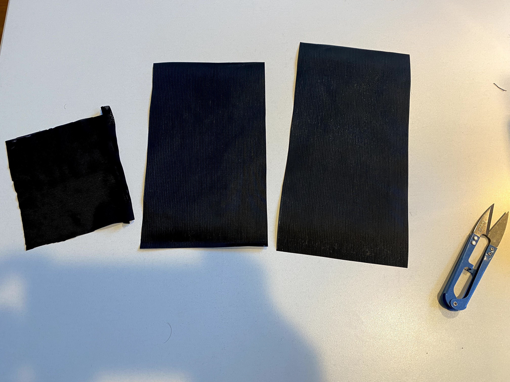
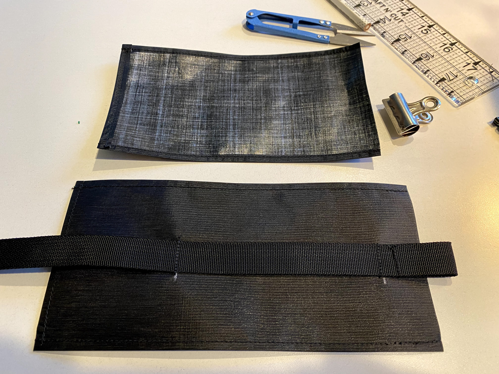
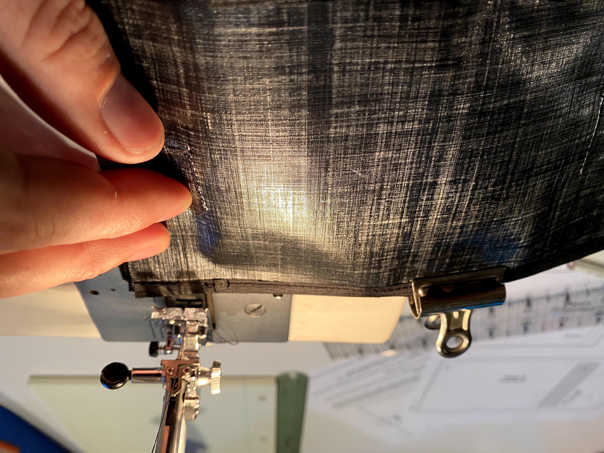
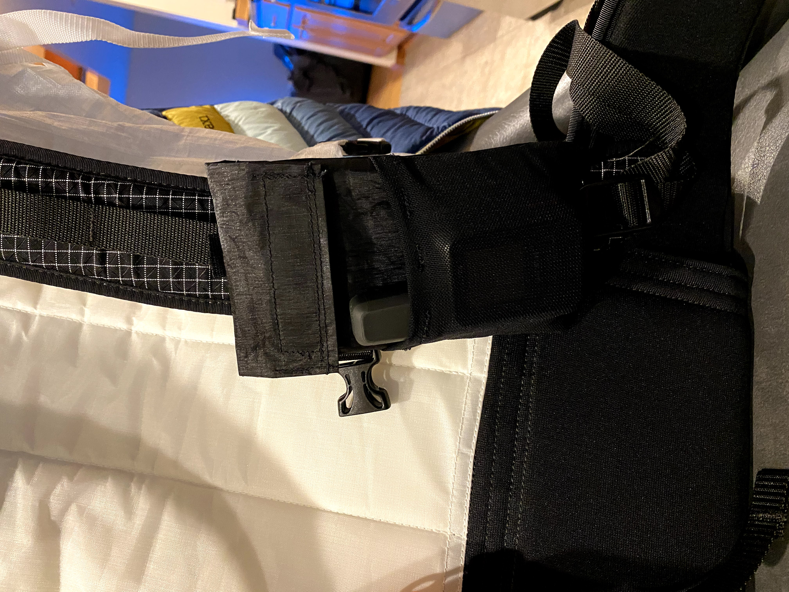

# Phone Pocket

This is a lightweight minimal pocket for attaching your phone to a backpack shoulder strap. I have the Hyperlite Mountain Gear [shoulder pocket](https://www.hyperlitemountaingear.com/collections/accessories/products/shoulder-pocket), but wanted something that (a) was a bit more minimal, and (b) had a quicker-to-use folding flap rather than a zipper. This phone pocket design is a very simple rectangle with a velcro folding flap, along with a small piece of optional stretch pocket mesh on the front for small items (I use it for my Garmin inReach Mini and a chapstick).

The [printable PDF](./phone-pocket/phone-pocket.pdf) is a template for an iPhone 11-ish sized phone with a thin case. You can easily adjust the size by adding width or length. It's better to oversize at first, because it is easy to shrink it later by sewing new seams inside your old ones and then trimming off the excess material.

I made mine with [2.92oz/yd hybrid dyneema](https://ripstopbytheroll.com/collections/dyneema-composite-fabric/products/2-92-oz-dyneema-composite-fabric-hybrid-ct5k-18-wov-32c?variant=1007084765210) from Ripstop by the Roll. The stretch [pocket mesh](https://www.seattlefabrics.com/60-Power-Mesh-1195-linear-yard_p_91.html) and hardware come from Seattle Fabrics. For the top adjustable hook I used a [Ghost Hook](https://www.seattlefabrics.com/Ghost-Eyereg-Tensionlockreg-with-Hook-Left-Version_p_372.html), and the bottom has a [Siamese Slick Clip](https://www.seattlefabrics.com/1-Siamese-Slick-Clip_p_370.html). The 3/4" webbing I used was standard [milspec from RSBTR](https://ripstopbytheroll.com/collections/webbing/products/1-nylon-webbing-black?variant=6999833601), but I'd love to find something ultralight next time. I dialed mine in to fit on the Hyperlite Mountain Gear [Prism Pack](https://www.hyperlitemountaingear.com/collections/40-l-backpacks-2400-series-40-liter-hiking-backpacks/products/prism-pack); you can just adjust the length/positioning of the webbing to fit your pack.

All up, my phone pocket weighs 22g (for reference, my HMG shoulder pocket weighs 38g).

Improvements to make:
 * I hem the long edges so that the top folding flap has a nice edge on the sides. However, the final step with the current design is a hem on the flap anyway, so the initial hemming could be skipped.

---

Paper prototypes

More paper prototypes!

Marking and cutting dyneema (needs sharp scissors)

Raw materials cut and ready to go

Main components hemmed and ready

Sewing the final panels together

Finished and installed!

